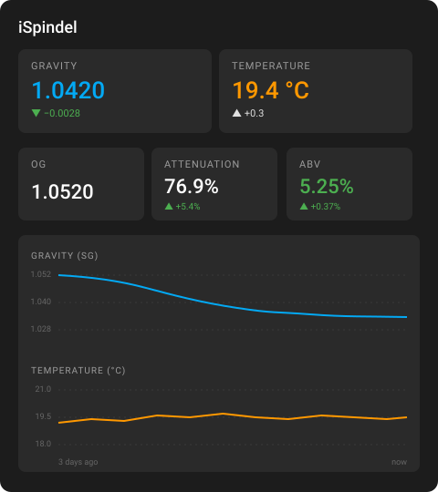

# Fermentation Tracker Card

[](https://github.com/hacs/integration)


A Home Assistant Lovelace card for monitoring homebrew fermentation. Designed around floating hydrometers like the iSpindel, Tilt and RAPT Pill, but works with any device exposing a gravity sensor.



## What it shows

- **Live gravity, temperature, and 24h change indicators** for the active fermentation
- **Auto-derived OG, attenuation, and ABV** — no need to remember or type in the original gravity
- **Trend graph** for gravity and temperature, with optional dual-axis ApexCharts mode
- **Optional device info** (signal strength + battery voltage) with its own tiles and (optionally) its own chart

## Smart auto range

The card defaults to "Auto" mode, which figures out when the current fermentation actually started by looking at the gravity history:

1. Drops readings outside a plausible SG range (0.99–1.20) — filters out the iSpindel sitting on its side, stored upright, etc.
2. Drops any reading within ±60 minutes of an out-of-range "junk" reading — these are typically settling readings while the iSpindel is still being placed in the wort
3. Drops isolated one-off readings that have no nearby reading at a similar value
4. Finds the most recent ≥6h gap in the cleaned readings — that's the start of the new fermentation

The graph and OG calculation both anchor to that detected start time. You can override with explicit presets (1d / 3d / 7d / 14d / 30d) or a custom hours value.

## Installation

This is a HACS Dashboard plugin.

1. In HACS, open the menu (top right) → **Custom repositories**
2. Add `https://github.com/agentgonzo/homeassistant-fermentation-tracker` as a **Dashboard** repository
3. Find **Fermentation Tracker Card** in the HACS dashboard list and click **Download**
4. Add the card to a dashboard via **Add Card** → **Fermentation Tracker**

## Configuration

All configuration is done through the visual editor. The schema is also valid YAML if you prefer to edit by hand.

| Option | Type | Description |
|---|---|---|
| `device_id` | string | Required. The fermentation device. Auto-discovers gravity and temperature entities from this device. |
| `name` | string | Optional title override (defaults to the device's name) |
| `gravity_entity` | string | Override gravity entity (auto-detected from device's `state_class: measurement` sensors if blank) |
| `temperature_entity` | string[] | One or more temperature entities (auto-detected from device's `device_class: temperature` sensor if blank). Multiple entities are plotted on the chart, and the first is shown in the temperature tile. |
| `gravity_unit` | `Plato` \| `Brix` | If set, shows the converted value as a secondary line beneath the SG reading (SG is always primary) |
| `time_range` | `auto` \| `1d` \| `3d` \| `7d` \| `14d` \| `30d` \| `custom` | Time window for the graph and OG calculation (default: `auto`) |
| `time_range_custom_hours` | number | Hours to use when `time_range` is `custom` (1–720) |
| `show_graph` | boolean | Show the trend graph (default: on) |
| `chart_type` | `default` \| `apex` | `default` uses HA's built-in history graph (stacks panels per unit). `apex` uses [apexcharts-card](https://github.com/RomRider/apexcharts-card) for a single chart with gravity on the left axis and temperature on the right axis. |
| `show_delta_24h` | boolean | Show 24h change arrows on each tile (default: on) |
| `show_device_info` | boolean | Show signal strength and battery voltage tiles (default: off). With `chart_type: apex` they get their own chart below the main one. |
| `signal_strength_entity` | string | Override signal strength entity (auto-detected from device's `device_class: signal_strength` sensor if blank) |
| `battery_entity` | string | Override battery entity (auto-detected from device's `device_class: voltage` sensor if blank) |

## Optional: ApexCharts mode

Selecting `Chart style: ApexCharts` requires [apexcharts-card](https://github.com/RomRider/apexcharts-card) to be installed via HACS. The card detects whether it's available and shows a friendly inline notice with the install link if not.

ApexCharts mode gives you:
- A single chart with gravity on the left y-axis and temperature on the right y-axis
- Per-series decimal precision in the legend (gravity to 4 dp, temperature to 1 dp)
- A separate chart below for signal/battery when device info is enabled

## Building from source

```sh
npm install
npm run build
```

Outputs `fermentation-tracker-card.js` at the repo root.

## Licence

MIT — see [LICENSE](LICENSE).
